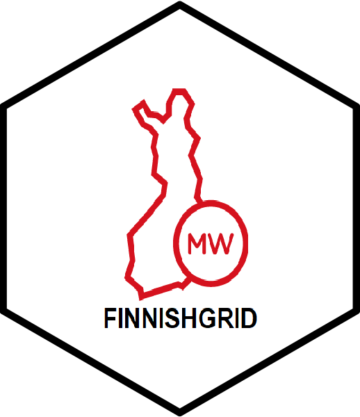

<!-- README.md is generated from README.Rmd. Please edit that file -->

```{r, include = FALSE}
knitr::opts_chunk$set(
  collapse = TRUE,
  comment = "#>",
  fig.path = "man/figures/README-",
  out.width = "100%"
)
```

# finnishgrid <a href='https://github.com/virmar/finnishgrid'></a>

<!-- badges: start -->
<!-- badges: end -->

The goal of finnishgrid is to provide an easy one-liner access to all Fingrid 
Open Data API functions.

## Installation

You can install the development version of finnishgrid from [GitHub](https://github.com/) with:

``` r
# install.packages("devtools")
devtools::install_github("virmar/finnishgrid")
```

## Free API registration

Read basic API specification at https://data.fingrid.fi/en/pages/api.

Register free user account at https://data.fingrid.fi/open-data-forms/registration/.

Optional: add API key as your environment variable (~/.Renviron) 

```{r, engine = 'bash', eval = FALSE}
FINGRID_OPENDATA_API_KEY=MY_SECRET_KEY_FROM_EMAIL
```

## Example

Let's get Finnish hourly electricity consumption and production time-series 
data for basic visualization.

```{r}
library(finnishgrid)
start_time = "2021-01-01T00:00:00+0200"
end_time = "2021-01-03T00:00:00+0200"
user_key = NA  # TODO: replace with right key or use .Renviron file
```

## Fetching data with helper functions

```{r}
elec_cons <- electricity_consumption_FI_RTD(start_time = start_time, 
                                            end_time = end_time, 
                                            user_key = user_key)

elec_prod <- electricity_production_FI_RTD(start_time = start_time, 
                                           end_time = end_time, 
                                           user_key = user_key)

min_elec_cons <- min(elec_cons$value)  # consumption
max_elec_cons <- max(elec_cons$value)

min_elec_prod <- min(elec_prod$value)  # production
max_elec_prod <- max(elec_prod$value)

y_max <- max(max_elec_cons, max_elec_prod)
y_min <- min(min_elec_cons, min_elec_prod)
```

## Basic data visualization 

```{r}
plot(elec_cons$start_time, elec_cons$value, type = 'l',
     col = "green", ylim = c(y_min, y_max),
     ylab = "Produced/Consumed (MW)",
     xlab = "Time", main = "Electricity")
lines(elec_prod$start_time, elec_prod$value, type = 'l', col = "blue")
legend("topright", c("Cons", "Prod"), fill = c("green", "blue"))
```

## Get electricity consumption in Finland with get_data() function

API page: https://data.fingrid.fi/en/dataset/electricity-consumption-in-finland

```{r}
tmp <- get_data(api_number = 124,  # energy consumption
                start_time = start_time, 
                end_time = end_time, 
                user_key = NA)
summary(tmp)
```
